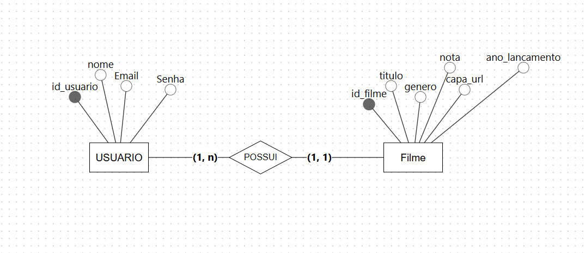

# Documento de Especificação de Requisitos - Catálogo de Filmes

## 1. Visão Geral do Projeto
O **Catálogo de Filmes** é um sistema para gerenciamento pessoal de acervo cinematográfico. O objetivo principal é substituir o controle manual feito por planilhas por uma plataforma intuitiva, onde o usuário possa cadastrar, visualizar, editar e excluir seus filmes, incluindo a capa/pôster de cada obra para compor uma galeria visual.

---

## 2. Requisitos Funcionais (RF)

Os requisitos funcionais descrevem as funcionalidades diretas e ações que o usuário poderá realizar no sistema:

| ID | Requisito Funcional | Descrição |
|---|---|---|
| **RF01** | Autenticação de Usuário | O sistema deve permitir que o usuário faça login utilizando nome de usuário/e-mail e senha para acessar seu acervo privado. |
| **RF02** | Cadastrar Filme | O sistema deve permitir o cadastro de novos filmes com os seguintes campos: título, ano de lançamento, gênero, nota (0 a 10) e upload da imagem da capa/pôster. |
| **RF03** | Visualizar Acervo (Galeria) | O sistema deve exibir a lista/galeria dos filmes cadastrados, apresentando visualmente a capa de cada filme junto aos seus dados principais. |
| **RF04** | Editar Filme | O sistema deve permitir a alteração das informações de um filme já cadastrado (ex: título, ano, gênero, nota e imagem da capa). |
| **RF05** | Excluir Filme | O sistema deve permitir a remoção de um filme do catálogo/galeria. |

---

## 3. Requisitos Não Funcionais (RNF)

Os requisitos não funcionais definem as qualidades, restrições e características técnicas do sistema:

| ID | Requisito Não Funcional | Descrição |
|---|---|---|
| **RNF01** | Segurança e Privacidade | Os dados e a galeria de filmes devem ser restritos ao usuário autenticado, impedindo o acesso público não autorizado. |
| **RNF02** | Usabilidade e Design | A interface deve ser focada em exibição visual estilo galeria/estante, sendo intuitiva e de fácil navegação. |
| **RNF03** | Armazenamento de Arquivos | O sistema deve ser capaz de processar, armazenar e servir arquivos de imagem (Formatos comuns: JPG, PNG) para as capas dos filmes. |
| **RNF04** | Validação de Dados | A nota do filme deve ser validada no intervalo rígido de 0 a 10. |
| **RNF05** | Desempenho e Carregamento | O carregamento da galeria de imagens e capas deve ser otimizado para proporcionar fluidez na navegação. |

---

## 4. Próximos Passos (Fora do Escopo Atual)
Recursos como compartilhamento de listas com terceiros, recomendações ou integração com APIs externas (ex: TMDB, IMDB) foram deixados explicitamente fora do escopo inicial, podendo ser avaliados em versões futuras.

